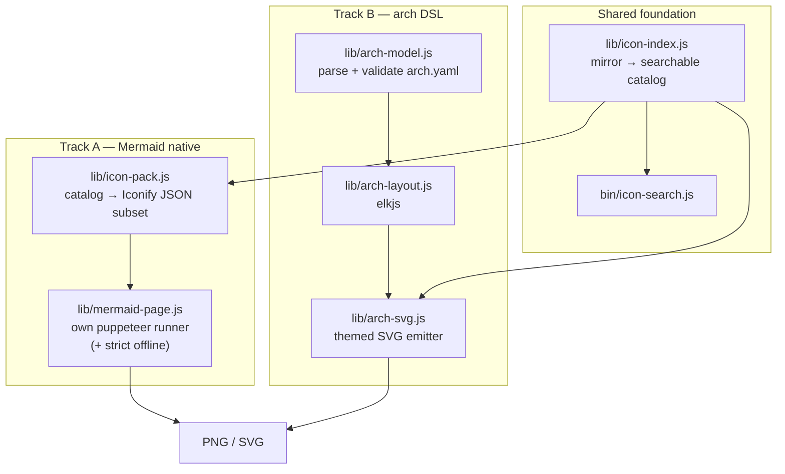

# Design: icon-rich architecture diagram rendering

**Status**: Proposed
**Date**: 2026-09-06
**Scope**: `diagram-renderer` v0.3.0 — add first-class, agent-authorable
architecture diagrams with Microsoft / GitHub product icons, keeping the
strict-offline guarantee.

---

## 1. Problem

Today the plugin can *render* icon-rich architecture diagrams, but it cannot
help anyone *author* one. The only supported path is a `.drawio.svg` that a
human built in the draw.io GUI, or that an agent hand-wrote element by element.

`agents/diagram-author.agent.md` makes this explicit — its draw.io recipe is a
raw SVG skeleton with hard-coded coordinates:

```xml
<image x="20"  y="120" width="64" height="64" xlink:href="https://www.draw.io/img/lib/azure2/compute/Function_Apps.svg"/>
<text  x="52"  y="210" ...>Function Apps</text>
<path  d="M88 152 L256 152" .../>
```

Three failure modes follow directly from that shape:

| # | Failure mode | Why it happens |
|---|---|---|
| F1 | **Icon name guessing.** The agent must produce `azure2/compute/Function_Apps.svg` exactly. A wrong case, category or separator fails the render. | There is no catalog. The agent doc's own advice is "use `web_fetch` to look up the correct snake_case ID on the draw.io shape browser". |
| F2 | **Manual layout.** Every `x`/`y`, every arrow path, every text baseline is authored by hand. Adding a node means re-flowing the whole diagram. | No layout engine. Nothing measures text. |
| F3 | **No boundaries.** Subscriptions, VNets, subnets, regions — the containers that make an architecture diagram *readable* — must be drawn as bare `<rect>`s and positioned by hand. | Same as F2. |

The renderer half is solid. The authoring half does not exist.

---

## 2. Current state

### 2.1 What already works

| Capability | Module | Notes |
|---|---|---|
| Mermaid → PNG/SVG/PDF | `lib/render.js` | Shells out to `mmdc`. |
| Extract ` ```mermaid ` fences from `.md` | `lib/extract.js` | |
| draw.io editable SVG → PNG | `lib/render-drawio.js` | Own puppeteer driver, measures the bbox, clips the screenshot. |
| Offline inlining of external `<image>` refs | `lib/inline-external-images.js` | Rule + alias resolver, path-traversal guarded, case-insensitive basename fallback. |
| Strict-offline guarantee (**draw.io only**) | `lib/render-drawio.js` | `setRequestInterception` aborts every `http(s):` request, then fails loudly if any was attempted. |
| Icon acquisition | `scripts/fetch-icons.sh` | Octicons auto (MIT); Azure / Entra / Power Platform via consent prompt + manual ZIP drop. |

### 2.2 Gaps this design closes

- **G1 — no icon catalog.** The only lookup key is a fake CDN URL. Nothing
  enumerates the mirror, nothing does fuzzy matching, nothing suggests
  alternatives on a miss. (→ F1)
- **G2 — no layout.** (→ F2, F3)
- **G3 — Mermaid has no offline guard.** `lib/render.js` spawns `mmdc`, which
  launches its own browser with no request interception. The strict-offline
  promise in the README holds for draw.io only. Any Mermaid feature that fetches
  (icon packs, remote fonts) would silently hit the network.
- **G4 — the mirror is not usable as a *source*.** It is only ever consulted
  reactively, keyed by a URL that appeared in someone else's SVG.

### 2.3 Defects found while analysing (fix separately)

These are pre-existing and orthogonal to the design; listed so they are not lost.

| ID | File | Problem |
|---|---|---|
| D1 | `agents/diagram-author.agent.md` §Step 3 | Instructs `node "$RENDERER/bin/render.js" ... --strict-offline`. **Neither exists** — the binaries are `bin/render-mermaid.js` / `bin/render-drawio.js`, and strict offline is the *default* (the flag is the opt-out `--allow-network`). Every agent run following Step 3 literally will fail. |
| D2 | `assets/icons/resolver-rules.json` | Rule `drawio-mscae` maps to `localBase: "m365/"`, but `fetch-icons.sh m365` intentionally extracts nothing ("no separate M365 pack"). The rule can therefore never resolve. |
| D3 | `skills/diagram-renderer/package.json` | `"version": "0.1.0"` vs `.plugin/plugin.json` `"version": "0.2.0"`. |
| D4 | `lib/render.js` `findChromium()` | Only probes Linux paths (`chrome-linux64/chrome`, `/usr/bin/...`). No Windows or macOS branch. |
| D5 | `README.md` | The "Asset licensing" + "Development" sections are duplicated verbatim at the end of the file. |
| D6 | `scripts/fetch-icons.sh` header | Claims it populates `~/.copilot/skills/diagram-renderer/.local-assets/`; the code actually writes `$SKILL_DIR/.local-assets`. |

---

## 3. Verified feasibility

Both tracks below rest on claims that were spiked against the installed plugin
(`mermaid@11.16.0`, `@mermaid-js/mermaid-cli@11.16.0`, `@iconify/utils`,
`elkjs` — all already present in `node_modules`).

### S1 — Mermaid `architecture-beta` renders local icon packs with zero network

A puppeteer page loads `mermaid.esm.mjs`, calls
`mermaid.registerIconPacks([{ name, icons }])` with the pack passed **as a plain
object through `page.evaluate`**, and renders. Request interception counted
**0 blocked `http(s)` requests**. Full-colour artwork (gradients, `<defs>`,
multiple fills) survives intact, and the icons come out as inline
`<g class="icon">` — **zero `<image>` elements**, so there is nothing left to
resolve at render time.

> This matters because `mmdc`'s own icon-pack options (`--iconPacks`,
> `--iconPacksNamesAndUrls`) both call `fetch(url)` *inside the page*. They are
> unusable offline. Driving mermaid ourselves sidesteps the fetch entirely
> **and** closes G3 as a side effect.

### S2 — `<defs>` id collisions are handled by Iconify, not by us

Real Microsoft icon SVGs declare gradients as `id="a"`, `id="b"`, … so two icons
in one document would be expected to collide on `url(#a)`. Spiked with two icons
that both declare `id="a"` with different gradient stops: **both rendered their
own colours correctly**, identical to the hand-namespaced control.

`@iconify/utils` rewrites ids at render time. **The pack builder does not need
an id-namespacing pass** — a meaningful scope reduction.

### S3 — module loading from `file://`

`import()` of `mermaid.esm.mjs` from a `file://` page is blocked (opaque origin,
`origin 'null'`). Two workable fixes; §5.3 picks one.

---

## 4. Design overview

Two tracks over one shared foundation.



Track A is cheap and gets icon-bearing architecture diagrams into the agent's
hands quickly. Track B is the one that produces presentation-grade output with
real boundaries and full brand control. They share the icon catalog, which is
the piece that actually fixes F1.

---

## 5. Shared foundation — the icon catalog

### 5.1 Why

Every current icon lookup is keyed by a **URL that someone else wrote**. To
author a diagram, an agent needs the inverse: *given the words "function app",
which local files could I mean?*

### 5.2 `lib/icon-index.js`

Walks `.local-assets/`, emits `.local-assets/.index.json`:

```jsonc
{
  "version": 1,
  "builtAt": "2026-09-06T00:00:00Z",
  "assetRoot": "/abs/path/.local-assets",
  "icons": [
    {
      "id": "azure:compute/function-apps",   // canonical, lowercase-kebab
      "set": "azure",
      "category": "compute",
      "name": "function-apps",
      "file": "azure/compute/Function_Apps.svg",
      "aliases": [
        "azure:function-apps",                       // category-less shorthand
        "azure:compute/Function_Apps",               // mirror filename
        "10029-icon-service-Function-Apps"           // original MS filename
      ],
      "keywords": ["function", "apps", "serverless", "compute"]
    }
  ]
}
```

Normalisation rules (they mirror what `fetch-icons.sh` already does on the way
in, so this is a read-side inverse, not a new convention):

- `Function_Apps.svg` → `function-apps`; `ai_machine_learning` → `ai-machine-learning`
- Both the normalised **and** the original MS filename become aliases —
  `fetch-icons.sh` deliberately writes both to disk, so both must resolve.
- `entra/color/ID.svg` → `entra:color/id`, aliased as `entra:id` (colour is the default flavour).
- `github/octicons/mark-github-24.svg` → `octicon:mark-github-24`, aliased as `octicon:mark-github` (largest size wins).

Resolution order for a reference: exact id → alias → case-insensitive → token
overlap on `keywords`. **A miss never renders a blank box** — it throws with the
top 5 nearest matches:

```
Unknown icon 'azure:compute/functions'.
Did you mean:
  azure:compute/function-apps        (azure/compute/Function_Apps.svg)
  azure:compute/functions-premium    (azure/compute/Functions_Premium.svg)
Run: node bin/icon-search.js function --set azure
```

That single behaviour is what removes F1.

### 5.3 Where the mirror lives

`lib/icon-index.js` owns discovery, so every consumer agrees:

1. `--asset-root` / `DIAGRAM_RENDERER_ASSET_ROOT`
2. `<skillRoot>/.local-assets` (what `fetch-icons.sh` actually writes — D6)
3. `~/.copilot/skills/diagram-renderer/.local-assets` (legacy, documented path)

If none exist, error with the exact `fetch-icons.sh` command to run.

> **Windows note.** `fetch-icons.sh` is bash and uses `find -printf` and `unzip`;
> it needs WSL or Git Bash. `.local-assets/` is absent on a plain Windows
> install. A Node port (`scripts/fetch-icons.mjs`) is out of scope here but is
> the natural follow-up — the index makes the gap visible instead of silent.

### 5.4 CLI (new capability)

```
icon-search <query...> [--set azure|entra|power-platform|octicon] [--limit N] [--json] [--rebuild]

  Search the local icon mirror. Prints `id  ->  file` lines, or JSON with --json.
  --rebuild forces a fresh index scan.
```

Declared in `.plugin/plugin.json` as `diagram.icons.search` v1.0.

---

## 6. Track A — Mermaid architecture diagrams with local icons

### 6.1 What the agent writes

```
architecture-beta
    group sub(azure:general/subscriptions)[Azure Subscription]

    service fe(azure:web/app-services)[Web App] in sub
    service fn(azure:compute/function-apps)[Function App] in sub
    service db(azure:databases/azure-cosmos-db)[Cosmos DB] in sub

    fe:R --> L:fn
    fn:R --> L:db
```

No coordinates, no URLs, no `<image>` elements. Icon references use the same
catalog ids as Track B.

### 6.2 How it renders

1. Scan the source for `(set:name)` tokens.
2. Resolve each against the catalog; unknown → throw with suggestions (§5.2).
3. Read only the matched SVGs, convert to an **Iconify JSON subset pack**
   (`lib/icon-pack.js`): strip the outer `<svg>`, keep `viewBox` as
   `width`/`height`, keep the inner markup verbatim as `body`. Per S2, no id
   rewriting needed.
4. Hand the pack to the page as a `page.evaluate` **argument** — not a URL, not
   a CLI arg. This sidesteps `MAX_ARG_STRLEN` (128 KiB on Linux, ~32 KiB total
   on Windows), which rules out the `data:`-URL-through-`mmdc` alternative for
   anything but toy packs.
5. Render with `mermaid.registerIconPacks` + `mermaid.render`, screenshot the
   measured bbox — the exact shape `lib/render-drawio.js` already uses.

### 6.3 `lib/mermaid-page.js` — replacing the `mmdc` subprocess

Track A cannot use `mmdc` (§3 S1), so it needs its own runner. That runner also
fixes G3, so `lib/render.js` should delegate to it for **all** Mermaid
rendering, not just architecture diagrams.

For S3 (module load from `file://`), prefer **request interception serving a
virtual origin** over the `--allow-file-access-from-files` flag:

```js
// One policy, no sandbox weakening:
//   https://diagram-renderer.local/*  -> req.respond() with bytes read from node_modules
//   any other http(s):                -> req.abort() + record as a violation
```

The flag works (verified in S1) but weakens Chromium's file sandbox process-wide
and creates a *second* offline policy to reason about. The virtual origin keeps
exactly one rule: **nothing leaves the machine**.

### 6.4 Limits of Track A — and why Track B still exists

`architecture-beta` is deliberately simple:

- Edge routing is `L`/`R`/`T`/`B` port hints only — no explicit waypoints.
- Group nesting is supported, but group **styling** is not (no dashed VNet vs.
  solid subscription, no per-kind fill, no CIDR sublabels).
- One label per node. No sub-labels (SKU, tier, region).
- No legend, no swimlanes, no annotation callouts.

Good enough for a "3 boxes and an arrow" slide. Not good enough for a reference
architecture.

---

## 7. Track B — the architecture DSL

### 7.1 Input: `arch.yaml`

```yaml
version: 1
title: Multi-tenant SCIM provisioning
theme: microsoft-light          # reuses themes/microsoft-{light,dark}.json
layout:
  direction: RIGHT              # RIGHT | DOWN
  nodeSpacing: 56
  groupPadding: 28

groups:
  - id: tenant
    label: Contoso tenant
    kind: tenant                # tenant | subscription | resource-group | region
                                # | vnet | subnet | onprem | generic
    children: [entra, sub]
  - id: sub
    label: Production subscription
    kind: subscription
    children: [vnet]
  - id: vnet
    label: hub-vnet
    sublabel: 10.0.0.0/16
    kind: vnet
    children: [fn, cosmos]

nodes:
  - id: hr
    label: Workday
    icon: octicon:organization
  - id: entra
    label: Microsoft Entra ID
    icon: entra:id
  - id: fn
    label: Function App
    sublabel: Premium EP1
    icon: azure:compute/function-apps
  - id: cosmos
    label: Cosmos DB
    icon: azure:databases/azure-cosmos-db

edges:
  - from: hr
    to: entra
    label: SCIM 2.0
  - from: entra
    to: fn
    label: OIDC
    style: dashed               # solid | dashed | dotted
  - from: fn
    to: cosmos
    label: SQL API

legend: auto                    # auto | none | [{ swatch, text }]
```

Design rules baked into the schema:

- **`kind` drives styling, not the author.** `vnet` → dashed 2px `#0078D4`
  border with a tinted fill; `subscription` → solid neutral; `onprem` → grey.
  The author states *what it is*, the theme decides *how it looks*. This is what
  keeps output consistent across decks.
- **Groups nest by `children` id refs**, not by YAML nesting, so a node can be
  declared once and placed anywhere without re-indentation churn.
- **`icon` uses catalog ids** (§5.2) — shared with Track A.
- **Edges never carry coordinates.** Routing is the layout engine's job.

Accepted as `.yaml`, `.json`, or stdin. JSON Schema published at
`assets/schema/arch.schema.json` so `slide-architect` and `diagram-author` can
validate before rendering.

### 7.2 Layout: `lib/arch-layout.js`

`elkjs` is already in `node_modules` (a mermaid dependency), so this adds no new
install weight. Use `layered` with `elk.direction` from `layout.direction`,
hierarchy handling on so groups become real ELK containers, and
`elk.edgeRouting: ORTHOGONAL` for architecture-style right-angle connectors.

Text is measured before layout — label widths feed ELK as node dimensions, so
long service names never overflow their box. (Measurement runs in the same
puppeteer page used for rasterisation, using the theme's font metrics.)

ELK returns absolute `x`/`y`/`width`/`height` for every node, group and edge
bend point. That is precisely the information F2/F3 were missing.

### 7.3 Emit: `lib/arch-svg.js`

Pure function `(laidOutModel, theme) -> svgString`:

- Icons inlined as `data:` URIs from the catalog — the same mechanism
  `inline-external-images.js` already uses, so the offline story is unchanged.
- Group chrome per `kind`, node cards with icon + label + optional sublabel,
  orthogonal edges with arrowheads and mid-point labels, optional auto legend.
- Emits **standalone SVG**. `--format svg` writes it directly; `--format png`
  hands it to the existing `renderDrawio()` screenshot path, which already
  measures a bbox and clips. No new rasterisation code.

That last point is deliberate: Track B adds a *front end*, and reuses the
existing, tested back end.

### 7.4 CLI (new capability)

```
render-arch <input.yaml|.json|-> --out <output.png|.svg> [options]

Options:
  --out, -o            Output path (REQUIRED)
  --theme              microsoft-light (default) | microsoft-dark
  --theme-file FILE    Custom theme JSON
  --scale N            Device scale (default 2)
  --format png|svg     Inferred from --out otherwise
  --asset-root DIR     Override local icon mirror
  --report-missing F   Dump unresolved icon refs to JSON
  --emit-svg FILE      Also write the intermediate SVG (debugging / hand-tweaking)
```

Declared as `diagram.render.arch` v1.0. `--emit-svg` matters: it gives an escape
hatch where a human can take the generated SVG into draw.io for a final nudge,
rather than the DSL being a dead end.

---

## 8. Phasing

| Phase | Deliverable | Depends on | Rough size |
|---|---|---|---|
| 0 | Fix D1–D6 | — | S |
| 1 | `lib/icon-index.js` + `bin/icon-search.js` + tests | — | M |
| 2 | `lib/mermaid-page.js` (own runner, strict offline) + `lib/render.js` delegates to it | — | M |
| 3 | `lib/icon-pack.js` + `--icon-pack`/auto-detect wiring → **Track A usable** | 1, 2 | M |
| 4 | `lib/arch-model.js` + `assets/schema/arch.schema.json` + validation tests | 1 | M |
| 5 | `lib/arch-layout.js` (elkjs) + text measurement | 4 | L |
| 6 | `lib/arch-svg.js` + `bin/render-arch.js` → **Track B usable** | 5 | L |
| 7 | Rewrite `agents/diagram-author.agent.md` around `icon-search` + `render-arch` | 3, 6 | M |
| 8 | `slides.json` bridge: `archFile` / `arch` content fields | 6 | S |

Phase 0 is worth doing first regardless of whether the rest proceeds — D1 makes
the bundled agent's documented workflow fail on contact.

Phases 1–3 stand alone: even if Track B is never built, they fix F1 and G3 and
give the agent working icon diagrams.

---

## 9. Risks and open questions

| Risk | Assessment | Mitigation |
|---|---|---|
| **Licensing.** Converting Microsoft SVGs into Iconify pack JSON could read as "modification". | The pack is built at render time from the user's own downloaded ZIP, lives in gitignored `.local-assets/`, is never committed or redistributed, and the rendered artwork is byte-identical to the source. Same posture as the existing data-URI inlining. | Keep packs out of git (extend `.gitignore` to `.index.json` / `.packs/`). Restate the posture in `assets/icons/LICENSE.md`. Confirm with the icon-pack terms before shipping. |
| **`architecture-beta` is beta.** Syntax may change in mermaid 12. | Track A is pinned to the vendored mermaid version; Track B does not depend on it at all. | Track B is the durable path; Track A is explicitly the cheap one. |
| **Layout quality.** ELK output may need tuning to look "architectural" rather than "graph-like". | Real, and the main reason phases 5–6 are sized L. | Build a corpus of 5–6 reference diagrams (hub-spoke, SCIM flow, event-driven, AKS) and iterate on ELK options against rendered PNGs. |
| **Mirror absent on Windows.** `fetch-icons.sh` needs WSL/Git Bash. | Confirmed: no `.local-assets/` on this machine. | Phase 1's error message names the exact command. A Node port is the follow-up. |
| **Replacing `mmdc` regresses existing renders.** | `lib/render.js` is a locked cross-plugin contract (CHARTER §4.2). | Keep the `renderMermaid()` signature byte-identical; swap only the internals. Add golden-image tests over the existing themes before the swap. |

**Open question.** Should `render-arch` also emit a `.drawio.svg` (mxGraphModel
embedded alongside the rendered SVG) so the output is editable in draw.io rather
than only viewable? It would close the authoring loop, but requires emitting
mxGraph XML that matches the SVG geometry. Proposed: defer past phase 6, and
ship `--emit-svg` as the interim escape hatch.

---

## 10. Summary

- The renderer is in good shape; **authoring is the gap**, and the icon catalog
  (§5) is the single change that removes the largest failure mode.
- Rendering Mermaid `architecture-beta` with local icon packs, fully offline,
  with full-colour Microsoft artwork, is **verified working** — not speculative.
- Driving mermaid ourselves is required for Track A and closes the
  strict-offline gap in the Mermaid path as a side effect.
- Track B (`arch.yaml` → ELK → themed SVG) is the presentation-grade path, and
  reuses the existing rasteriser rather than adding a second one.

---

## Appendix A — reproducing S1

Minimal reproduction of §3 S1. Run against an installed skill root that has
`npm install` completed (`mermaid@11.16.0` + `puppeteer` in `node_modules`).

```js
// s1.mjs — node s1.mjs <skillRoot> <out.png>
import fs from 'node:fs';
import path from 'node:path';
import { pathToFileURL } from 'node:url';
import { createRequire } from 'node:module';

const [, , skillRoot, outPng] = process.argv;
const require = createRequire(pathToFileURL(path.join(skillRoot, 'noop.js')));
const puppeteer = require('puppeteer');
const mermaidEsm = path.join(skillRoot, 'node_modules', 'mermaid', 'dist', 'mermaid.esm.mjs');

// Stand-in for a pack lib/icon-pack.js would build from .local-assets/.
// Full-colour with <defs>/gradients on purpose, to prove non-monochrome
// Microsoft artwork survives the Iconify → mermaid pipeline.
const pack = {
  prefix: 'msdemo', width: 24, height: 24,
  icons: {
    'function-apps': { body:
      '<defs><linearGradient id="g1" x1="0" y1="0" x2="0" y2="1">' +
      '<stop offset="0" stop-color="#5EA0EF"/><stop offset="1" stop-color="#0078D4"/></linearGradient></defs>' +
      '<rect x="1" y="1" width="22" height="22" rx="3" fill="url(#g1)"/>' +
      '<path d="M13.5 5 L8 13h3.2l-1 6 5.8-8.6h-3.3z" fill="#FFF"/>' },
    'cosmos-db': { body:
      '<circle cx="12" cy="12" r="10" fill="#0078D4"/>' +
      '<ellipse cx="12" cy="12" rx="10" ry="4" fill="none" stroke="#FFF" stroke-width="1.4"/>' +
      '<ellipse cx="12" cy="12" rx="4" ry="10" fill="none" stroke="#FFF" stroke-width="1.4"/>' },
  },
};

const diagram = `architecture-beta
    group azure(msdemo:function-apps)[Azure Subscription]
    service api(msdemo:function-apps)[Function App] in azure
    service db(msdemo:cosmos-db)[Cosmos DB] in azure
    api:R --> L:db
`;

const browser = await puppeteer.launch({
  headless: true,
  // Makes import() of a file:// module work from a file:// page (opaque origin
  // otherwise). §6.3 recommends replacing this with a request-interception
  // virtual origin so the sandbox is not weakened process-wide.
  args: ['--no-sandbox', '--allow-file-access-from-files'],
});
const blocked = [];
try {
  const page = await browser.newPage();
  await page.setRequestInterception(true);
  page.on('request', (req) => {
    if (/^https?:/i.test(req.url())) { blocked.push(req.url()); req.abort('failed').catch(() => {}); }
    else req.continue().catch(() => {});
  });

  const tmpHtml = path.join(path.dirname(outPng), '_s1.html');
  fs.mkdirSync(path.dirname(outPng), { recursive: true });
  fs.writeFileSync(tmpHtml, '<!DOCTYPE html><body style="margin:0;background:#fff"><div id="c"></div>');
  await page.goto(pathToFileURL(tmpHtml).href, { waitUntil: 'load' });
  await page.setViewport({ width: 1200, height: 800, deviceScaleFactor: 2 });

  const svg = await page.evaluate(async (mermaidUrl, def, iconPack) => {
    const { default: mermaid } = await import(mermaidUrl);
    // KEY: the pack crosses as a plain object argument — no fetch, no data: URL,
    // and therefore no MAX_ARG_STRLEN ceiling on pack size.
    mermaid.registerIconPacks([{ name: iconPack.prefix, icons: iconPack }]);
    mermaid.initialize({ startOnLoad: false, theme: 'neutral' });
    const { svg } = await mermaid.render('spike', def);
    document.getElementById('c').innerHTML = svg;
    return svg;
  }, pathToFileURL(mermaidEsm).href, diagram, pack);

  const box = await page.evaluate(() => {
    const r = document.querySelector('#c svg').getBoundingClientRect();
    return { x: r.left, y: r.top, width: r.width, height: r.height };
  });
  await page.screenshot({ path: outPng, clip: box });

  console.log('svgBytes=' + svg.length);
  console.log('embedded <image> count=' + (svg.match(/<image/g) || []).length);
  console.log('blockedNetworkRequests=' + blocked.length);
} finally { await browser.close(); }
```

Observed 2026-09-06:

```
svgBytes=6170
embedded <image> count=0        <- icons inlined as <g class="icon">
blockedNetworkRequests=0        <- strict offline holds
```

**S2** is the same script with two icons whose bodies both declare `id="a"` with
different gradient stops. Both rendered their own colours correctly, matching a
hand-namespaced control — confirming `@iconify/utils` rewrites ids for us.

